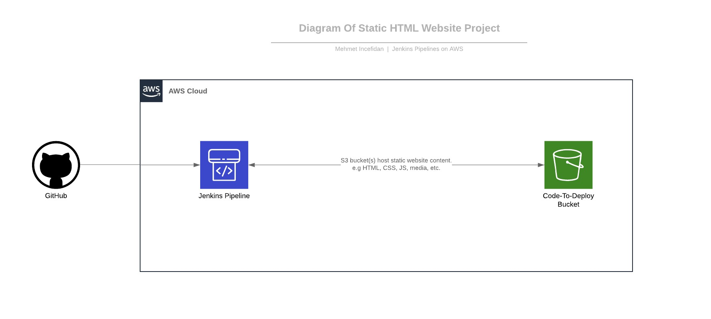

# Project 3 - Jenkins Pipelines on AWS



> In this project (Static HTML Website),I will build CI/CD Pipeline for Blue/Green Deployment so I created and run an instance > on AWS, configured Jenkins, and then created a pipeline to deploy a static website on S3.

## The files included are:
```sh
* /Images-of-result-deploy : Screenshot the result of deploy.
* index.html : Static HTML Website's index page.
* jenkinsfile : Jenkins pipeline script.
* policy.json : Bucket's policy.
```
